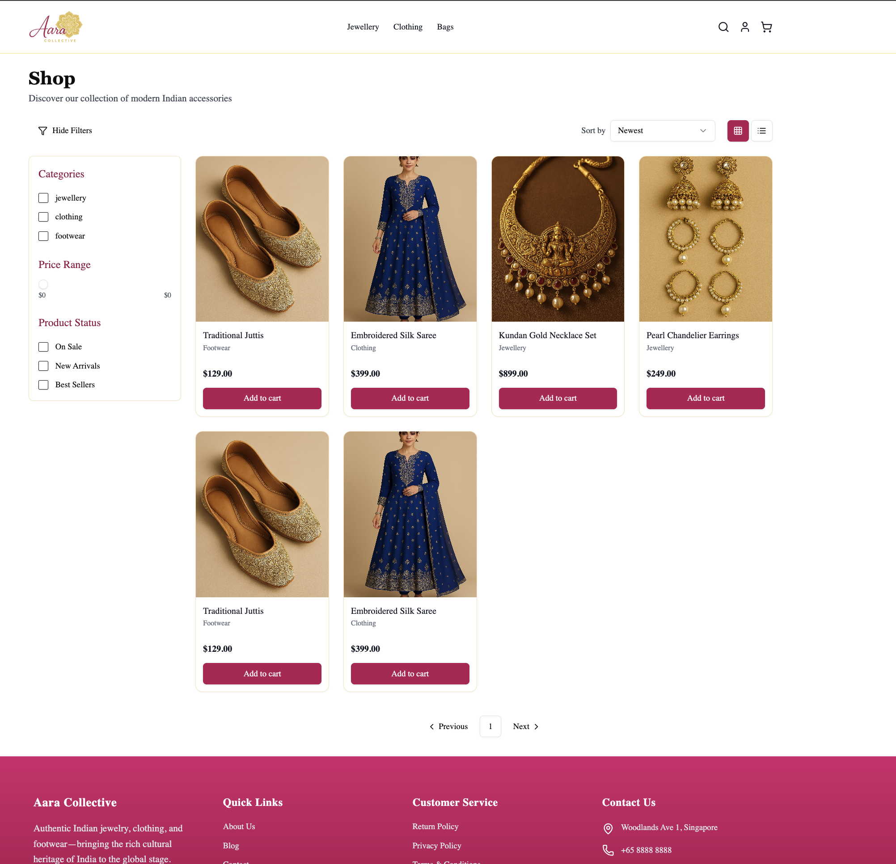

# 💎 Aara Collective E-Commerce Platform

A full-stack application designed to sell **Indian jewellery, clothing, and accessories** globally.  
Built as a modern e-commerce store with a dedicated admin portal, it supports browsing, product management, checkout, and order fulfillment.

The app allows customers to search, view, filter, and buy products, while admins can manage products, coupons, orders, and settings.

---

## 🎮 Screenshots

### Home Page

### Shop Page with Filters

---

## 🛠️ Technologies Used

### Frontend

- React 18
- TypeScript
- Tailwind CSS 3.4
- shadcn/ui
- React Router

### Backend

- Node.js + Express
- TypeScript
- Prisma ORM
- PostgreSQL (Relational DB)
- Stripe API (Payments)
- Clerk SDK (Authentication & Roles)

### Infrastructure

- AWS (planned deployment)
- Context API for global state
- Zod for DTO validation
- RESTful APIs

---

## 🔗 Demo

Launch Aara Collective Store 👉 \_coming soon\_www.Aaracollective.com

---

## 📂 Features

✅ Browse products with filters, sort, pagination  
✅ View product details, variants, and related products  
✅ Add items to cart and manage cart globally  
✅ Checkout flow with shipping, coupons, and Stripe integration  
✅ Clerk authentication for login/signup and profile management  
✅ Protected routes for signed-in users and role-based access for admins  
✅ Admin portal to manage products, orders, inventory, coupons, returns, and reports  
✅ Zod-validated DTOs ensure clean API requests  
✅ Transactions to guarantee consistent order + stock updates

---

## 📅 Future Improvements

- [ ] Wishlist & favorites for customers
- [ ] Email notifications for order confirmations
- [ ] Enhanced analytics in admin reports
- [ ] Support for returns/refunds workflow
- [ ] Product image uploads via AWS S3 presigned URLs
- [ ] SEO optimization and social media sharing previews

---

## 📖 API References

- [Stripe API](https://stripe.com/docs/api) – Payments
- [Clerk Authentication](https://clerk.com/docs) – User auth & roles
- [Prisma](https://www.prisma.io/docs) – Database ORM
- [React Router](https://reactrouter.com/en/main) – Frontend routing

---

## 🤝 Acknowledgements

This project is built as part of **Deepu Joseph’s journey** to learn modern full-stack development and launch an e-commerce business (**Aara Collective**) with his wife Anna.

Inspired by the simplicity of starting businesses in Singapore and the growing global demand for Indian jewellery and clothing.

---

Happy Shopping ✨
